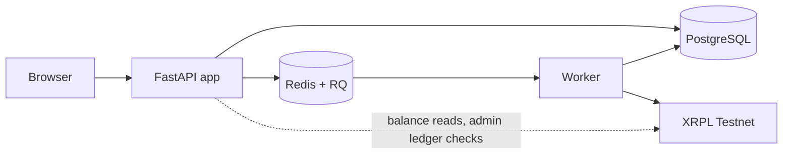

# Orbyt — XRPL-Based FX Remittance Platform (UCTUSD)

> The repository name still says "RLUSD" for historical reasons; the platform settles in UCTUSD.

ECO5040W · Financial Software Engineering · University of Cape Town

Orbyt is a prototype cross-border remittance platform on the XRPL Testnet. A sender in South Africa
pays in ZAR and gets a transparent FX quote. The recipient receives **UCTUSD**, a UCT-issued test IOU,
into a dedicated platform-managed XRPL account. The recipient can then cash out to USD or ZAR, which
burns the tokens on-ledger.

---

## What's real and what's simulated

| Element | Status |
|---|---|
| XRPL Testnet settlement (treasury → recipient), trust lines, cash-out burns (recipient → issuer) | **Real.** Every transfer is a validated ledger transaction with a hash linked to the Testnet explorer |
| Card cash-in | Simulated: no card network. The card is Luhn/expiry/CVV-checked and only the last 4 digits are stored. `4242 4242 4242 4242` succeeds; `4000 0000 0000 0002` is always declined. An admin confirms receipt in place of a processor |
| Fiat cash-out payout | Simulated in the database (`SIMPAY-…` reference); the burn is real |
| KYC verification | Manual admin review of a form; no identity vendor |
| Fees, FX margin, market rate, limits | Placeholder values, editable by an admin |

---

## Tech stack

| Layer | Choice |
|---|---|
| Back end | Python 3.11, FastAPI (async), Jinja2 server-rendered templates |
| Data | PostgreSQL, SQLAlchemy 2.0 async + Alembic (migrations `0001`–`0010`) |
| Queue | Redis + RQ 2.0: one `settlement` queue for settlement and burn jobs |
| Ledger | XRPL Testnet via xrpl-py 4.0 |
| Security | Fernet-encrypted recipient seeds, bcrypt passwords, signed-cookie sessions (8 h, not JWT) |
| Front end | Bootstrap 5.3.3 skinned by `frontend/static/css/design-system.css` (`ds-` classes), Bootstrap Icons, Inter |

---

## Getting started

### 1. Prerequisites

- **Python 3.11+**
- **PostgreSQL**: `brew services start postgresql` (use your installed version, e.g. `postgresql@16`)
- **Redis** (queue for settlement and cash-out): `brew services start redis`, or
  `docker run -d -p 6379:6379 redis`

### 2. Install

```bash
git clone https://github.com/francescabehr/XRPL-Based-FX-Remittance-Platform-Using-RLUSD.git
cd XRPL-Based-FX-Remittance-Platform-Using-RLUSD
python3 -m venv .venv
source .venv/bin/activate
make install
```

### 3. Configure

```bash
cp .env.example .env
```

Then set each value in `.env`:

| Variable | What it is | Where the value comes from |
|---|---|---|
| `DATABASE_URL` | App database (asyncpg driver) | Copy as-is; change user, password or port to match your Postgres |
| `SECRET_KEY` | Signs the session cookie | Generate: `python -c "import secrets; print(secrets.token_hex(32))"` |
| `DEBUG` | Development mode; `true` also serves `/dev/styleguide` | Copy as-is (`false`) |
| `ADMIN_EMAIL` | Email of the admin created by `make seed-admin` | Copy as-is, or choose your own |
| `ADMIN_PASSWORD` | That admin's password | Copy as-is, or choose your own |
| `ADMIN_NAME` | That admin's display name | Copy as-is |
| `ADMIN_MOBILE` | That admin's mobile number | Copy as-is |
| `REDIS_URL` | Redis for the RQ queue | Copy as-is |
| `XRPL_JSON_RPC` | XRPL Testnet JSON-RPC endpoint | Copy as-is |
| `XRPL_ISSUER_ADDRESS` | UCTUSD issuer; cash-outs burn tokens by sending them here | Copy as-is |
| `XRPL_CURRENCY_CODE` | On-ledger UCTUSD code (40-character hex) | Copy as-is; it was read from the ledger (see below) |
| `XRPL_PLATFORM_WALLET_ADDRESS` | Treasury wallet that pays recipients | Copy as-is |
| `XRPL_PLATFORM_WALLET_SEED` | Treasury wallet secret; controls all UCTUSD liquidity | **Provided by the team; never committed** |
| `XRPL_ENCRYPTION_KEY` | Fernet key that encrypts recipients' XRPL seeds (url-safe base64, not hex) | Generate: `python -c "from cryptography.fernet import Fernet; print(Fernet.generate_key().decode())"` |
| `TEST_DATABASE_URL` | Database used by `make test`; must name `remittance_test` | Copy as-is; change credentials as for `DATABASE_URL` |
| `FX_RATE_SOURCE` | `config` reads the admin-editable rate; `static` pins the rate below | Copy as-is (`config`) |
| `FX_STATIC_MARKET_RATE` | ZAR per USD when `FX_RATE_SOURCE=static` | Copy as-is |
| `DISPLAY_TIMEZONE` | Time zone for displayed times and daily/monthly limit windows | Copy as-is |

#### Treasury wallet

Every settlement payment is signed by the treasury wallet, an XRPL Testnet account holding test
XRP, a UCTUSD trust line and a UCTUSD balance. The team's treasury,
`rMcBddj7AD6aEFoPSeSL8HpqVJMMxaezoz`, was created with the `onboard_customer.py` example script from
the course's UCTUSD repository (https://github.com/marclevin/UCTUSD), which creates the account,
funds it with Testnet XRP and sets the trust line. Its
seed is not in this repository.

To use your own treasury, create a wallet the same way, have the token administrator send it
UCTUSD, and set `XRPL_PLATFORM_WALLET_ADDRESS` and `XRPL_PLATFORM_WALLET_SEED`. The two must belong
to the same wallet. A mismatch is not caught at startup: the worker's first settlement payment
fails with a configuration error before anything is sent and, after its retries, is marked failed
on `/admin/settlements`.

`XRPL_CURRENCY_CODE` must never be guessed. If the issuer changes, re-read it from the treasury's
trust line with `python scripts/check_currency.py` and copy it verbatim. Switching issuer or IOU is
a configuration change only.

### 4. Databases

```bash
createdb remittance_db
createdb remittance_test
make migrate      # creates the tables and default fees and limit tiers
make seed-admin   # creates the admin from the ADMIN_* values in .env
```

### 5. Run

Use two terminals, both with the virtualenv active:

```bash
make dev      # terminal 1: web app on http://localhost:8000
make worker   # terminal 2: settlement and cash-out burns
```

On macOS, `make worker` uses RQ's `SimpleWorker` because macOS kills RQ's default forked
work-horses; do not change the worker class.

If the worker is not running, the app still works, but a confirmed cash-in stays queued and an
approved cash-out is never burned. The jobs wait in Redis and are processed when the worker starts.

### 6. Try it

Use a separate browser or private window for each user, so the sessions do not overwrite each
other.

1. **Admin:** sign in at `/login` with `ADMIN_EMAIL` / `ADMIN_PASSWORD`. You land on `/admin`.
2. **Recipient:** register at `/register`. Every new account starts as a sender, so the recipient
   sees a "complete your KYC" prompt; they can ignore it.
3. **Sender:** register at `/register`, then submit the KYC form at `/kyc`.
4. **Admin:** open the submission at `/admin/kyc` and approve it.
5. **Sender:** add the recipient at `/beneficiaries/new` with the email they registered with, then
   send R100 at `/send` (Details → Review → Pay). Pay with card `4242 4242 4242 4242`, any
   future expiry (MM/YY) and any 3-digit CVV.
6. **Admin:** at `/admin/cashin`, click **Received**. This queues the settlement, and the worker
   pays the recipient from the treasury. The first transfer to a new recipient takes about 40 s,
   because the worker creates and funds the recipient's XRPL account, sets its trust line, and
   then pays. Progress shows on the sender's `/transactions` and on `/admin/settlements`.
7. **Recipient:** open `/wallet` to see the UCTUSD balance and the transaction hash, linked to the
   Testnet explorer. Request a cash-out at `/cashout` (enter an amount, review the priced
   preview, confirm).
8. **Admin:** approve the request at `/admin/cashout`. The worker burns the full amount by sending
   it back to the issuer. The request then shows as completed, with the burn hash and a simulated
   `SIMPAY-…` payout reference.

What the walkthrough depends on:

- The recipient must be registered before the sender sends. A beneficiary is matched to an account
  by email or mobile, and the match is re-checked at send time. If the recipient has not
  registered, the send is refused.
- The recipient needs no KYC. Their wallet and the `/cashout` page appear only after the first
  transfer to them has settled.
- Redis, the worker and the XRPL Testnet must all be reachable for steps 6–8.

### 7. Tests

```bash
make test
```

The suite has **577 tests**. It runs only against the `remittance_test` database named in
`TEST_DATABASE_URL` and fakes XRPL and Redis, so it spends no Testnet funds and needs no network.

---

## User roles and features

Roles are three independent flags on `users` (`is_admin`, `can_send`, `can_receive`), so one
account can both send and receive. An account becomes a recipient when its XRPL wallet is
provisioned, on the first transfer to it.

- **Public:** landing page at `/`, footer pages (`/about`, `/contact`, `/help`, `/legal/…`), and `/register` and `/login`.
- **Sender:** submits KYC, saves beneficiaries (who must be registered users), then sends money through 
Details → Review → Pay → Status. The quote is live, the minimum send is R50, tier limits apply, and a server-side price lock refuses any change. Live status and hashes are on `/transactions`; the profile is at `/profile`.
- **Recipient:** sees the UCTUSD balance and incoming and outgoing activity on `/wallet`, and cashes out to USD or ZAR from a priced preview. The full amount is burned; the fee comes off the fiat payout, charged in USD before conversion.
- **Admin:** every route under `/admin` depends on `dependencies.py:require_admin`, and a test walks the route table to assert it.

| Screen | Route | FR |
|---|---|---|
| Overview: pending KYC, pending cash-ins, open cash-outs, failed settlements, settled today (admin landing page after login) | `/admin` | FR-ADM-01 (admin-only access) |
| KYC review queue | `/admin/kyc` | FR-ADM-02 |
| Cash-in confirmation queue | `/admin/cashin` | FR-ADM-03 |
| Transaction monitor + drill-down (filters: status, date range, user, AML flag) | `/admin/transactions` | FR-ADM-04 |
| Settlement monitor (retry / recover) | `/admin/settlements` | FR-ADM-05 |
| Cash-out approval queue (approve / reject / reconcile) | `/admin/cashout` | FR-ADM-05 |
| Fee, FX, minimum-send and limit configuration (applies to later quotes only) | `/admin/config` | FR-ADM-06, FR-FX-08, FR-LIM-05 |
| AML review flag (set from the drill-down, filterable in the monitor) | `/admin/transactions/{id}/aml` | FR-ADM-07 |

---

## Architecture and security



Only the worker signs transactions, the web app never does.

- **Idempotent claim:** one conditional `UPDATE` on `idempotency_key` and status; duplicates stop.
- **Hash before submit:** hash and `LastLedgerSequence` range are committed before submission.
- **Retries only before signing** (up to 3 attempts). Signed transactions are never auto-resubmitted;
  an admin retry re-sends only when the ledger proves the old attempt dead.
- **Unknown burns are never auto-reversed:** the balance stays held until an admin reconciles
  against the ledger. Elapsed time is never evidence.
- **Balance debited once, restored once:** debited at cash-out approval under `SELECT … FOR UPDATE`
  with the status change; only the conditional approved → failed transition restores it.
- **Serialised treasury signing:** a Redis lock (`queue_service.treasury_lock`) protects the
  treasury's sequence number.
- **Housekeeping:** every 120 s, stranded never-signed burns are re-published and cash-ins
  unconfirmed for 24 h are expired.
- **Keys:** seeds are decrypted only when signing, never returned or logged; the Fernet key and
  treasury seed live in `.env` (gitignored, never committed). Only `xrpl_service.py` imports
  `security/crypto.py` within `app/`.
- **Auth:** bcrypt passwords, signed-cookie sessions (not JWT, by choice), admin checks at the
  dependency layer, client prices always re-derived server-side.

---

## Performance

Reference run: 50 users for 3 minutes, 200 synthetic sender/recipient pairs,
simulated-ledger worker (`perf/results/run_stats.csv`). Method, charts and the 10–100 user tiers: [perf/REPORT.md](perf/REPORT.md).

| Measure | Result |
|---|---|
| Requests / failures | 6,872 / 0 |
| Throughput | 38.5 requests per second |
| Response time (all requests) | 16 ms median, 390 ms p95 |
| `POST /remittances` | 22 ms median, 52 ms p95 |
| Slowest p95 | `POST /login` 10,000 ms · `GET /send` 5,000 ms · `GET /wallet` 1,400 ms |
| XRPL payment, real Testnet (3 samples) | 14.1 s mean (13.0–16.3 s) |
| First transfer to a new recipient | 42 s (faucet account + trust line + payment) |
| Settlement drain, simulated ledger, 1 worker | ~9 per minute |

Bottlenecks: bcrypt blocks the event loop on login; one worker cannot drain the queue (and real
treasury payments are serialised at about 4 per minute); `/wallet` waits on a live ledger call.

> **Never load-test against `make worker`.** It would attempt real Testnet payments and drain the
> treasury. Use `make perf-worker`, which simulates the ledger.

---

## Known limitations

- There is no login rate limiting.
- There are no CSRF tokens; only `SameSite=lax` cookies protect forms.
- HTTPS is assumed to be handled by a proxy, and the session cookie is not `https_only`.
- Sessions cannot be revoked before their 8-hour expiry, and the cookie is re-issued on activity.
- Recipient accounts are funded by the Testnet faucet. Mainnet would need treasury-funded XRP
  reserves.
- Treasury payments are signed one at a time, so real settlement tops out near 4 per minute.
- Unregistered beneficiaries cannot be paid.
- Recipients are not KYC-checked; a production service would verify them before allowing cash-out.
- A burn whose worker dies after signing, but before the outcome is recorded, has no Reconcile
  button; its hash must be checked on the ledger by hand.
- A confirmed cash-in whose queue message was never published has no automatic re-publish. An
  admin re-queues it from `/admin/settlements` after 10 minutes.
- Notifications are in-app only.
- Fees, margin and limits are placeholder values.

---

## Use of AI

The team used Claude Code as a development assistant, working under the conventions recorded in [CLAUDE.md](CLAUDE.md). All changes were reviewed, tested and integrated by team members.

---

## Further documentation

Functional requirements are in [requirements.md](requirements.md), and measured performance is in [perf/REPORT.md](perf/REPORT.md). Design and development notes (UI design brief, build plan, internal code audit) are in docs/. The Business and Technical Specification is submitted separately.

---

## Out of scope

- Real funds, real card processing, or XRPL Mainnet
- Production KYC/AML vendor integration, and sanctions/PEP screening
- Cash-out currencies other than USD and ZAR
- Email or SMS notifications
