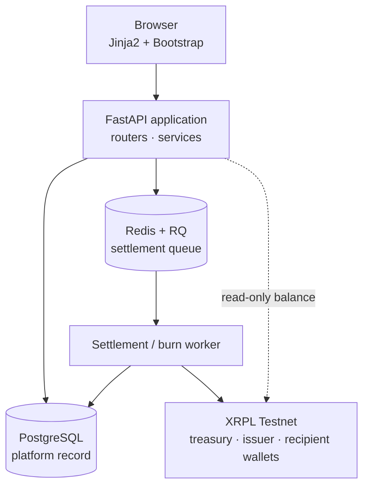
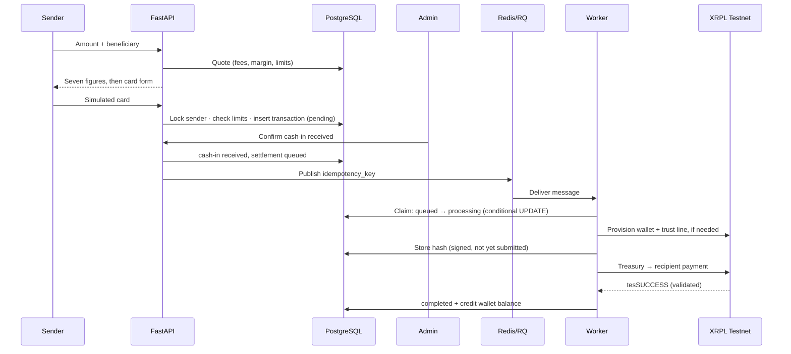
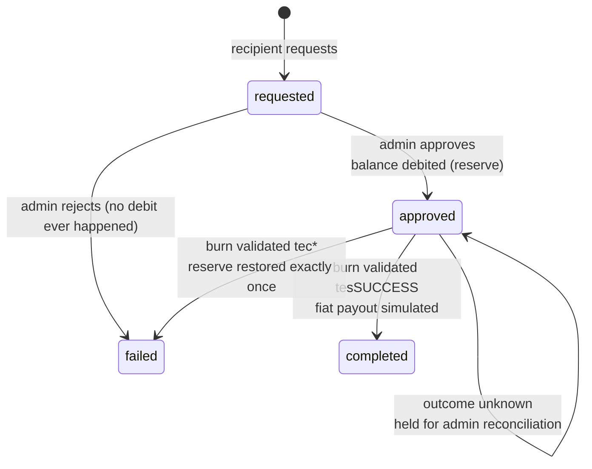

# Business and Technical Specification

**XRPL-Based FX Remittance Platform (UCTUSD)**
ECO5040W — Financial Software Engineering, University of Cape Town
Version 1.0 · 21 September 2026 · Satisfies Project Brief §7.i

This document describes the system as built. It assumes the functional requirements in
[requirements.md](requirements.md) (v1.2) and does not repeat them: requirement IDs (FR-XXX-nn) are
cited where a design decision implements one. Measured performance is summarised in §8 and reported
in full in [perf/REPORT.md](perf/REPORT.md).

---

## 1. Business context

The platform moves money from a South African sender to a recipient abroad, using a stablecoin as
the settlement rail instead of correspondent banking. The sender pays in ZAR by card; the recipient
receives **UCTUSD**, a UCT-issued test IOU on the XRP Ledger Testnet, into a platform-managed wallet;
the recipient converts it to USD or ZAR through a simulated cash-out.

Two properties motivate the design:

- **Settlement is final in seconds, not days.** A measured treasury-to-recipient payment validates in
  about 14 seconds (§8), against 1–5 business days for a correspondent-banking transfer.
- **Every transfer is publicly verifiable.** Each settled transaction carries a ledger hash that the
  sender, recipient and administrator can open in a block explorer, which is not true of a SWIFT
  reference.

What is real and what is simulated:

| Element | Status |
|---|---|
| XRPL Testnet settlement, trust lines, on-chain burn | **Real** — every transfer is a validated ledger transaction |
| Card cash-in | Simulated: shape checks only, no card network, only the last 4 digits stored |
| Fiat cash-out payout | Simulated in the database; the **burn is real** |
| KYC verification | Manual admin review of a submitted form; no identity vendor |
| Fees, margin and limits | Placeholder values pending a team decision |

---

## 2. System architecture

The web application never talks to the ledger to move money; it only reads balances. Everything that
signs a transaction runs in the worker, reached through the queue. That boundary is what makes a slow
or failing ledger a queue backlog rather than a user-facing error.

| Layer | Choice | Why |
|---|---|---|
| Web framework | FastAPI (async) | Concurrent I/O to Postgres and XRPL; generates the OpenAPI docs used for the quote API |
| Persistence | PostgreSQL 16, async SQLAlchemy, Alembic | Row-level locking (`SELECT … FOR UPDATE`) is required for correct balance and limit handling |
| Queue | Redis + RQ | One queue, explicit retry semantics, simpler to reason about than Celery for this scope |
| Ledger client | xrpl-py | Official SDK; signs locally, never sends a seed to a node |
| Templates | Jinja2 + Bootstrap 5, server-rendered | No client-side state to keep in step with the ledger |
| Sessions | Starlette `SessionMiddleware` | Signed browser cookie; see §6.1 and its limitation |

**Deployment shape.** One application process, one or more worker processes, Postgres and Redis. Worker
count is the throughput dial (§8). Configuration, including all XRPL addresses and secrets, comes from
the environment — switching issuer or settlement asset is a configuration change, not a code change
(Brief §4).

---

## 3. Data model

Seven tables, migrations `0001`–`0007`.

| Table | Holds | Notable constraints |
|---|---|---|
| `users` | Accounts and role flags | Unique email and mobile; `is_admin` / `can_send` / `can_receive` are independent booleans, so one account can do both |
| `kyc_submissions` | Submitted KYC, decision, reviewer | Latest submission drives `users.kyc_status` |
| `beneficiaries` | A sender's saved recipients | `recipient_user_id` links to the receiving account; removal is a soft delete |
| `limit_tiers` | Daily/monthly ZAR limits per tier | `unverified` = R0; `standard` = R10,000 / R50,000 (placeholders) |
| `fee_config` | Fixed fee, percentage fee, FX margin, cash-out fee, market rate | One active row; edits affect later quotes only |
| `transactions` | A remittance and its two lifecycles | `idempotency_key` UUID **unique** — the anti-double-credit key |
| `wallets` | One XRPL account per recipient | Unique `user_id` and `xrpl_address`; holds the Fernet-encrypted seed and a key fingerprint |
| `cashout_requests` | A cash-out, its pricing snapshot and burn | Pricing snapshotted at request; `xrpl_burn_tx_hash` holds the on-chain burn |

**Money.** All amounts are `Decimal`, never float: ZAR to 2 decimal places, UCTUSD to 6, rates to 6,
rounded half-up. Every transaction and cash-out request stores the figures it was priced with, so a
later fee change can never rewrite history (FR-FX-08).

**Balances.** `wallets.balance_uctusd` is a platform-side cache; the ledger is authoritative. It is
written only after on-ledger validation (FR-WAL-06), always under a row lock.

**The treasury is not a row.** The platform's source-of-funds wallet lives in configuration. Its seed
is the system's most sensitive secret (§6.2).

---

## 4. Settlement flow (cash-in → UCTUSD)

**Pricing is never trusted from the browser.** The rate the sender saw is submitted as a hidden field
and compared against a fresh server-side quote; if it moved, the payment is refused and a new quote
shown. The row is then written entirely from the server's own figures.

**Limits are race-free (FR-LIM-01/02).** The sender's row is locked before usage is summed, and the
lock is held until the new transaction is inserted and committed, so two simultaneous sends cannot
both consume the same remaining allowance. A test spawns concurrent sends against a shared limit and
asserts exactly one succeeds.

**Settlement cannot start early (FR-CI-03).** The settlement message is published only after the
cash-in transitions to received, and that transition is itself a conditional update, so a double-click
or a repeated API call cannot publish a second message.

**Idempotency (FR-MQ-04).** The worker's first action is one conditional `UPDATE … WHERE
idempotency_key = ? AND settlement_status = 'queued'`. Exactly one delivery can win; a duplicate,
a redelivery or a simultaneous second worker matches no row and stops. This is asserted both by
repeated delivery and by concurrent delivery in the test suite, and was confirmed on the live system.

**Crediting (FR-WAL-06).** On `tesSUCCESS` from a validated ledger, the status change and the balance
credit commit in one database transaction, with the wallet row locked. Any other result leaves the
balance untouched and records the ledger's own code as the reason (FR-WAL-07).

---

## 5. Cash-out flow (UCTUSD → fiat, via an on-chain burn)

Cash-out is the settlement path in reverse: the recipient's own account pays UCTUSD to the issuer,
which destroys the tokens, and the fiat leg is simulated in the database.

- **The balance moves exactly once (FR-CO-06).** It is debited when an admin approves, under a row lock
  behind a balance check, and restored only by the single conditional transition from approved to
  failed. Restores only ever add, so a balance cannot go negative.
- **Pricing is snapshotted at request time**, so the terms the recipient accepted are the terms honoured
  at approval.
- **The full amount is burned**; the cash-out fee is taken from the simulated fiat payout, not from the
  burn, so the ledger and the platform's arithmetic agree.
- **An unknown outcome is never guessed.** If a burn is signed but its result is not observed, the row
  stays approved with the reserve still held, and is never resubmitted automatically. Only an
  administrator reconciling against the ledger resolves it. This is the deliberate choice to risk a
  delayed payout rather than a double burn.

---

## 6. Security design

### 6.1 Authentication and authorisation

- Passwords are hashed with bcrypt and never stored or logged in plaintext (FR-AUTH-02).
- Sessions are **signed browser cookies** (`SessionMiddleware`), which is why a session cannot be
  revoked before its 8-hour expiry. This is an accepted limitation, recorded in requirements.md §9.2;
  a server-side session store would fix it.
- **Admin access has exactly one gate:** `dependencies.py:require_admin`. Every admin route depends on
  it, and a test walks the route table to assert no admin route bypasses it. Authorisation is never
  implemented by hiding a link.
- Ownership is checked per object: a transaction is visible only to its sender, its recipient, or an
  administrator.

### 6.2 Key management (FR-WAL-03, FR-WAL-04)

| Secret | Where it lives | Protection |
|---|---|---|
| Recipient XRPL seeds | `wallets.encrypted_private_key` | Fernet-encrypted; each row records a fingerprint of the key that sealed it, so keys can be rotated |
| Fernet encryption key | Environment (`XRPL_ENCRYPTION_KEY`) | Never in the database — a database dump alone yields no usable key material |
| Treasury seed | Environment (`XRPL_PLATFORM_WALLET_SEED`) | Controls all UCTUSD liquidity; never committed, never logged |
| Passwords | `users.password_hash` | bcrypt |

A seed is decrypted only inside the signing path, only at the moment of signing, and is never returned
by any route, written to a log, or included in an error message. `security/crypto.py` is imported by
one module only, which keeps that surface auditable, and a test asserts no seed appears in log output.
Transactions are signed locally; no seed is ever sent to an XRPL node.

### 6.3 Other controls

- The currency code, issuer and treasury address are configuration, read from the ledger and never
  hardcoded — a wrong currency code is the classic failure mode for issued currencies.
- Card details are validated for shape only and discarded; only the last 4 digits persist.
- Client-supplied prices are always re-derived server-side before money moves (§4, §5).

### 6.4 Known gaps

No rate limiting on login, no CSRF tokens (session cookies are `SameSite=lax`, which blocks the common
cross-site form post but is not a substitute), no sanctions or PEP screening, and HTTPS is assumed to
be terminated by a proxy in deployment rather than configured here.

---

## 7. Reliability and failure handling

**Ledger result codes drive behaviour.** `tesSUCCESS` means applied; a `tec` code means recorded but
failed, with the fee taken and no funds moved. The platform branches on these rather than on
exceptions, and stores the code as the user-visible reason.

| Observed code | Cause | Handling |
|---|---|---|
| `tecPATH_DRY` | Destination has no UCTUSD trust line | Marked failed; balance untouched; admin can retry |
| `tecPATH_PARTIAL` | Sender lacks the UCTUSD | Same |
| Invalid currency code | Configuration error | Rejected client-side by xrpl-py before submission |

**Retry policy (FR-MQ-06).** The dividing line is whether a transaction was signed.

- *Before signing* (network, faucet, trust line not yet set): nothing reached the ledger, so the job is
  re-queued with backoff, up to three attempts, then marked failed for an administrator.
- *After signing*: never retried automatically. The hash is written to the database **before**
  submission, so an interrupted attempt is always traceable. An administrator's retry queries the
  ledger first: a payment that actually succeeded is recorded as completed rather than re-sent, and a
  retry is refused while the transaction could still land.
- *A crashed worker* leaves a row claimed. After ten minutes — longer than the job timeout, so no live
  worker can still hold it — an administrator can recover it, with the same ledger check.

**Queue outages** are visible, not silent: if publishing fails, the transaction is marked failed with
`queue_unavailable` and appears in the admin settlement monitor for a retry.

**Administrator tooling** covers each of these: the settlement monitor lists failed, stuck and
queued-too-long transfers with their reasons and hashes; the cash-out queue offers reconciliation for
unknown burn outcomes; the transaction monitor filters by status, date, user and AML flag.

---

## 8. Performance

Measured at 50 concurrent users for 3 minutes against 200 synthetic accounts; full method, charts and
raw data in [perf/REPORT.md](perf/REPORT.md).

| Measure | Result |
|---|---|
| Requests / failures | 6,647 / **0** |
| Throughput | 37 requests per second |
| Response time | 15 ms median, 330 ms 95th percentile |
| Create a remittance (the heaviest write) | 22 ms median, 70 ms p95 |
| XRPL payment, real Testnet | 14.1 s mean (13.0–16.3 s) |
| First transfer to a new recipient | 42 s (faucet account + trust line + payment) |
| Settlement throughput | ~9/min per worker simulated; ~4/min against the real ledger; near-linear in worker count |

**Bottlenecks identified.** (1) bcrypt verification takes 232 ms and runs inside the async login
handler, blocking the event loop and stalling unrelated requests — it belongs in a thread pool.
(2) A single worker cannot drain the settlement queue under load; worker count is the throughput dial.
(3) The wallet page waits on a live ledger call (1.3 s p95) that could be deferred or cached. No
database lock contention was measurable at this load, despite the locking in §4 and §5.

The NFR 7.2 sub-second target is met by every screen except login and the wallet page, for the reasons
above.

---

## 9. Testing strategy

212 automated tests run against a dedicated test database; XRPL and Redis are faked in unit tests, so
no test spends Testnet funds or depends on the network.

| Area | Tests | Notable coverage |
|---|---|---|
| Cash-out (`test_cashout.py`) | 59 | Reserve, restore-once, unknown-outcome hold, reconciliation |
| XRPL + crypto (`test_xrpl.py`) | 32 | Seed encryption, ledger failure codes, hash-before-submit, no seeds in logs |
| Cash-in (`test_cashin.py`) | 25 | Limits under concurrency, card validation, cash-in gating |
| Admin (`test_admin.py`) | 23 | Every admin route gated; monitor filters |
| Queue and worker (`test_queue.py`) | 21 | Duplicate **and** concurrent delivery, retry policy, stuck recovery |
| Auth, KYC, beneficiaries, limits, FX, display | 52 | Phases 1–4 behaviour, worked FX example to 6 dp |

**Ledger behaviour was verified live** rather than assumed: a standalone script proved account
creation, trust line, payment, burn and the failure codes on Testnet before that code entered the
application, and the complete cash-in-to-settlement path was then run end to end through the real
web routes, queue and worker.

---

## 10. Regulatory and compliance discussion

The platform is a teaching prototype on a test network with no real funds, so no licence applies. A
production version in South Africa would need the following, and the build already has places for most
of them.

- **Customer due diligence (FICA).** South Africa's Financial Intelligence Centre Act requires an
  accountable institution to identify and verify customers. The platform collects identity data and
  blocks transacting until an administrator approves it, which is the right shape, but verification is
  a human reading a form. Production requires an identity-verification provider, document
  authenticity checks, and periodic re-verification.
- **Cross-border reporting.** South African exchange-control rules require reporting of cross-border
  transfers, and FICA requires reporting cash threshold and suspicious transactions. The transaction
  monitor and AML flag give an administrator the surface to review and mark transactions, but there is
  no automated report generation or submission.
- **Sanctions and PEP screening.** Not implemented, and it is the largest compliance gap: names are
  never screened against sanctions or politically-exposed-person lists.
- **The travel rule.** Transfers of virtual assets above a threshold must carry originator and
  beneficiary information between institutions. Here both ends are inside one platform, so the data
  exists in one database; interoperating with an external institution would need a protocol for
  exchanging it.
- **Data protection (POPIA).** The system stores identity documents' numbers, addresses and financial
  history. It encrypts key material and hashes passwords, but has no retention policy, no subject
  access or deletion mechanism, and no data-residency controls.
- **Custody.** The platform holds recipients' private keys, making it a custodian of customer assets.
  That carries capital, segregation and audit obligations, and would require a hardware security module
  or a managed custody service rather than Fernet-encrypted seeds in a database column.
- **Consumer protection.** Every fee and the applied rate are disclosed before payment, on one screen,
  which meets the transparency intent of the brief.

---

## 11. Assumptions and limitations

Summarised here; stated in full in [requirements.md](requirements.md) §9.2.

- Recipients must hold a platform account; an unregistered beneficiary cannot be paid.
- Notifications are in-application only.
- Sessions cannot be revoked before expiry.
- Recipient accounts are funded by the Testnet faucet; mainnet would require treasury-funded reserves.
- Settlement throughput is bounded by worker count (§8).
- Fee, margin and limit values are placeholders.
- The platform relies on the issuer having Default Ripple enabled, which lets treasury-to-recipient
  payments find a path. The issuer controls that setting; it was confirmed working by test payment.

---

## 12. Operations

**Configuration** (all via environment): database and Redis URLs, session secret, XRPL endpoint, issuer
address, currency code, treasury address and seed, the Fernet key, the FX rate source and the display
timezone.

**Running it:** apply migrations (`make migrate`), start the application (`make dev`) and at least one
worker (`make worker`). On macOS the worker must run in-process, because the operating system kills
RQ's default forked job processes — a failure found during live testing and fixed in the Makefile.

**Scaling:** add worker processes for settlement throughput; add application workers for request
throughput.

**Runbook.** Stuck or failed settlements appear at `/admin/settlements` with their reason, hash and
attempt count, and are retried or recovered from there. Cash-outs with an unknown outcome appear at
`/admin/cashout` for reconciliation against the ledger. Neither action re-sends a payment that the
ledger has already accepted.

**Timezone:** timestamps are stored and computed in UTC — including the daily and monthly limit
windows, which reset at midnight UTC — and displayed in `DISPLAY_TIMEZONE`, by default South African
Standard Time.

---

## Appendix: requirement traceability

| Requirements | Implementation | Tests |
|---|---|---|
| FR-AUTH-01..07 | `routers/auth.py`, `services/auth_service.py`, `security/hashing.py` | `test_auth.py` |
| FR-KYC-01..05 | `routers/kyc.py`, `services/kyc_service.py` | `test_kyc.py` |
| FR-BEN-01..05 | `routers/beneficiaries.py`, `services/beneficiary_service.py` | `test_beneficiaries.py` |
| FR-LIM-01..05 | `services/limit_service.py` (inside the send transaction) | `test_limits.py`, `test_cashin.py` |
| FR-FX-01..08 | `services/fx_service.py`, `GET /quote` | `test_fx.py` |
| FR-CI-01..05 | `routers/transactions.py`, `services/cashin_service.py` | `test_cashin.py` |
| FR-MQ-01..06 | `services/queue_service.py`, `workers/settlement_worker.py` | `test_queue.py` |
| FR-WAL-01..07 | `services/xrpl_service.py`, `security/crypto.py`, `routers/wallet.py` | `test_xrpl.py` |
| FR-CO-01..06 | `routers/cashout.py`, `services/cashout_service.py`, `workers/cashout_worker.py` | `test_cashout.py` |
| FR-ADM-01..07 | `routers/admin.py`, `dependencies.py:require_admin` | `test_admin.py` |
| Brief §7.iv | `perf/` | [perf/REPORT.md](perf/REPORT.md) |
