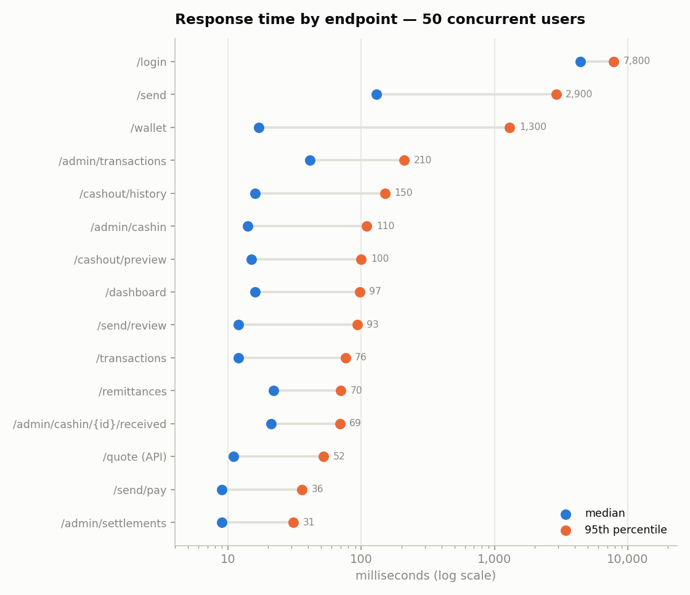
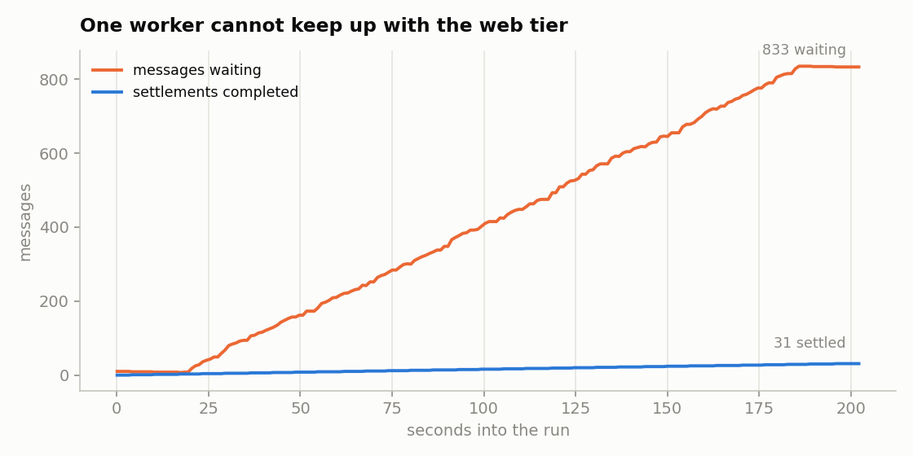
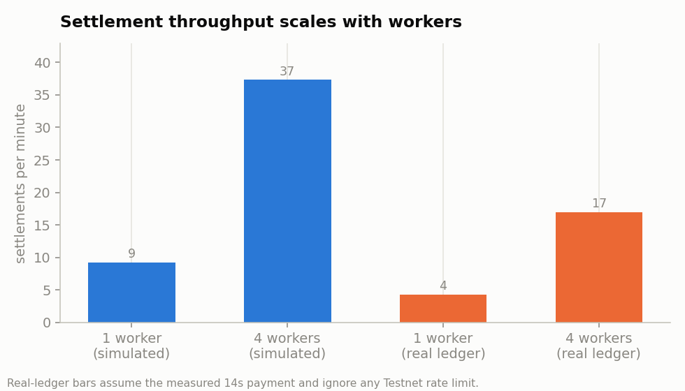

# Performance Report — XRPL FX Remittance Platform

Phase 9 (Brief §7.iv). Every number below comes from a measured run on 21 September 2026;
nothing is estimated. Raw output is in `perf/results/`.

## Summary

The web tier is fast and stable: **6,647 requests, 0 failures, 37 requests/second**, with a
**15 ms median** response time under 50 concurrent users. Two things do not keep up:

1. **Login costs 232 ms of CPU and blocks the whole server** while it runs, so 50 simultaneous
   logins queue behind each other (median 4.4 s, worst 8.4 s) and delay unrelated requests.
2. **One settlement worker handles about 9 transfers a minute**, while the web tier accepted
   997 confirmed cash-ins in 3 minutes. The queue grew to 833 waiting messages and never recovered.

Neither is a design flaw in the settlement logic; both are capacity settings. Adding workers scales
settlement almost linearly, and moving password hashing off the event loop is a small change.

## Method

| Item | Value |
|---|---|
| Machine | Apple M2, 8 cores, 8 GB RAM, macOS 26.3.1 |
| Runtime | Python 3.12.2, single Uvicorn process (1 worker, no reload) |
| Data stores | PostgreSQL 16.15 and Redis 7, both in Docker |
| Synthetic data | 200 sender/recipient pairs (400 accounts) from `perf/seed_data.py` (Faker) |
| Load profile | `perf/locustfile.py`: 50 users, spawn 5/s, 3 minutes — senders (6), recipients (3), admin (1) |
| Settlement worker | `perf/perf_worker.py` — real queue, real database, **simulated ledger** |
| Real ledger timings | `perf/measure_xrpl.py` — separate run against XRPL Testnet |

**Why the load test simulates the ledger.** Real settlement needs a faucet account per recipient and
a treasury payment per transfer. Both are rate-limited on Testnet and spend real test funds, so a
50-user run cannot use them. The simulated worker keeps everything the platform controls real — the
queue, the claim, the database writes, the wallet credit — and replaces only the two XRPL calls with
a fixed delay. Real ledger times are measured separately and reported below, and the throughput
chart shows both.

## API response times



| Endpoint | Requests | Median (ms) | p95 (ms) | Max (ms) | Failures |
| --- | ---: | ---: | ---: | ---: | ---: |
| **All requests** | 6,646 | 15 | 330 | 8,366 | 0 |
| POST /admin/cashin/{id}/received | 997 | 21 | 69 | 4,970 | 0 |
| GET /send/pay | 856 | 9 | 36 | 3,623 | 0 |
| GET /send/review | 856 | 12 | 93 | 3,618 | 0 |
| POST /remittances | 855 | 22 | 70 | 7,053 | 0 |
| GET /quote (API) | 694 | 11 | 52 | 2,928 | 0 |
| GET /wallet | 579 | 17 | 1,300 | 5,809 | 0 |
| GET /dashboard | 542 | 16 | 97 | 2,393 | 0 |
| GET /transactions | 383 | 12 | 76 | 3,341 | 0 |
| POST /cashout/preview | 323 | 15 | 100 | 4,592 | 0 |
| GET /cashout/history | 204 | 16 | 150 | 4,850 | 0 |
| GET /admin/cashin | 195 | 14 | 110 | 3,597 | 0 |
| POST /login | 50 | 4,400 | 7,800 | 8,366 | 0 |
| GET /admin/transactions | 45 | 41 | 210 | 3,583 | 0 |
| GET /admin/settlements | 37 | 9 | 31 | 131 | 0 |
| GET /send | 30 | 130 | 2,900 | 3,928 | 0 |

Money-moving requests are among the fastest: creating a remittance (which locks the sender's row,
prices the quote, checks limits and inserts the transaction) has a 22 ms median and a 70 ms p95.
The **sub-second interaction target in NFR 7.2 is met by every screen except login and the wallet
page**, and the multi-second maximums are all collateral from the login problem below.

## Message queue and settlement throughput



With one worker, the queue grew steadily for the whole run: the admin confirmed cash-ins far faster
than a single worker could settle them.

| Measure | 1 worker | 4 workers |
| --- | ---: | ---: |
| Settlements per minute (simulated ledger) | 9.2 | 37.3 |
| Messages waiting at the end of the 3-minute run | 833 | — |
| Backlog drained in the following 127 s | — | 79 |

Scaling is close to linear (4.05× throughput from 4 workers), which is what the design predicts:
each job claims its own transaction, so workers never contend except on their own database rows.



## UCTUSD transaction processing time (real Testnet)

| Step | Samples | Min (s) | Mean (s) | Max (s) |
| --- | ---: | ---: | ---: | ---: |
| Create recipient account (faucet) | 1 | 11.6 | 11.6 | 11.6 |
| TrustSet to issuer | 1 | 14.1 | 14.1 | 14.1 |
| Treasury → recipient payment | 3 | 13.0 | 14.1 | 16.3 |
| **First transfer to a new recipient** | 1 | — | **42.0** | — |

A recipient's first transfer costs about 42 seconds, because the account and trust line are created
first. Later transfers to the same recipient cost about 14 seconds, nearly all of it waiting for the
ledger to validate. This matches the end-to-end Phase 6 run (39 s) closely.

At 14 s per payment, one worker settles about 4 transfers a minute against the real ledger, and 4
workers about 17 — assuming Testnet applies no rate limit of its own, which this run was too small
to test.

## Bottlenecks found

**1. Password hashing blocks the event loop (the big one).** `verify_password` takes 232 ms of CPU
and is called directly inside the `async def` login handler, so it blocks the single event loop
thread. Every other request waits behind it. This explains both the 4.4 s median login and the
3–5 s maximums scattered across otherwise fast endpoints: those requests arrived while someone was
logging in. The fix is to run hashing in a thread (`asyncio.to_thread` or Starlette's
`run_in_threadpool`), which frees the loop; more Uvicorn workers would also spread the cost.
bcrypt's cost is deliberate and should not be lowered.

**2. A single worker cannot drain the settlement queue.** The web tier confirmed cash-ins at roughly
5 per second while one worker settled 0.15 per second. Nothing was lost — messages waited, which is
what a queue is for — but a recipient would wait minutes for money that the ledger takes seconds to
move. Running 4 workers (`make worker` in several terminals) raised throughput 4× and is the
straightforward fix. Capacity planning should use the real-ledger rate, about 4 settlements per
minute per worker.

**3. The wallet page waits on the live ledger.** `GET /wallet` has a 17 ms median but a 1.3 s p95,
because it fetches the on-ledger balance with a 5-second timeout. The cached balance is already in
the database. Loading the ledger figure after the page renders, or caching it briefly, would make
the page as fast as the rest.

**4. No database lock contention was observed.** The row locks taken when creating a remittance and
when crediting a wallet did not slow anything measurably: 855 remittance inserts held a p95 of
70 ms. The locks are per-sender and per-recipient, and the load spread across 200 senders. A test
concentrating many sends on one sender would be the way to probe this further.

**5. `GET /send` at 2.9 s p95 is collateral, not its own problem.** It is requested once per user at
startup, exactly when 50 users are logging in, so it inherits the login stall. Its median (130 ms)
reflects the same query pattern as `/send/review` (12 ms) plus the beneficiary list.

## Recommendations, in order

| # | Change | Effect |
|---|---|---|
| 1 | Run `verify_password`/`get_password_hash` in a thread pool | Removes multi-second stalls across every endpoint |
| 2 | Run 3–4 settlement workers | ~4× settlement throughput; queue drains instead of growing |
| 3 | Render the wallet page from the cached balance; fetch the ledger figure separately | Wallet p95 from 1.3 s to tens of ms |
| 4 | Run Uvicorn with several workers in deployment | Uses more than one of the 8 cores |

## Reproducing this

```bash
python perf/seed_data.py 200            # synthetic users (--purge to remove)
make dev                                # terminal 1
python perf/perf_worker.py              # terminal 2 (simulated ledger)
python perf/sampler.py perf/results/queue.csv    # terminal 3
locust -f perf/locustfile.py --headless -u 50 -r 5 -t 3m \
       -H http://127.0.0.1:8000 --csv perf/results/run
python perf/measure_xrpl.py 3           # real Testnet timings (spends 1.5 UCTUSD)
python perf/analyze.py                  # charts + the tables above
```

**Do not run a load test with the real worker (`make worker`).** It would attempt hundreds of real
Testnet payments and drain the treasury.

## Limitations

- Load-test settlement used a simulated ledger (4 s per payment); real payments measured 14 s.
  The throughput chart labels which bars are which.
- Real-ledger timings are 3 payment samples, 1 account creation and 1 trust line — enough for an
  order of magnitude, not for a distribution.
- Everything ran on one laptop, so the app, both data stores and Locust itself shared 8 cores.
- Testnet is a shared public network; its latency varies with its own load.
