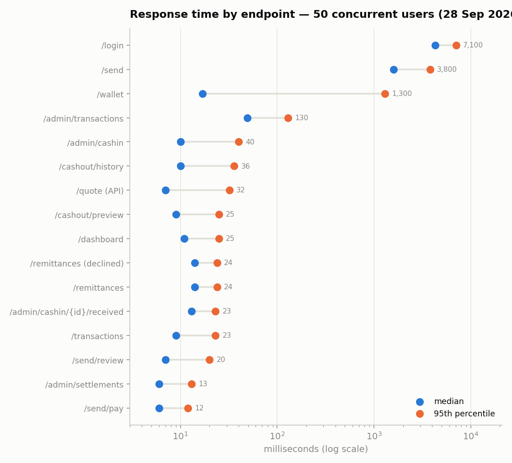
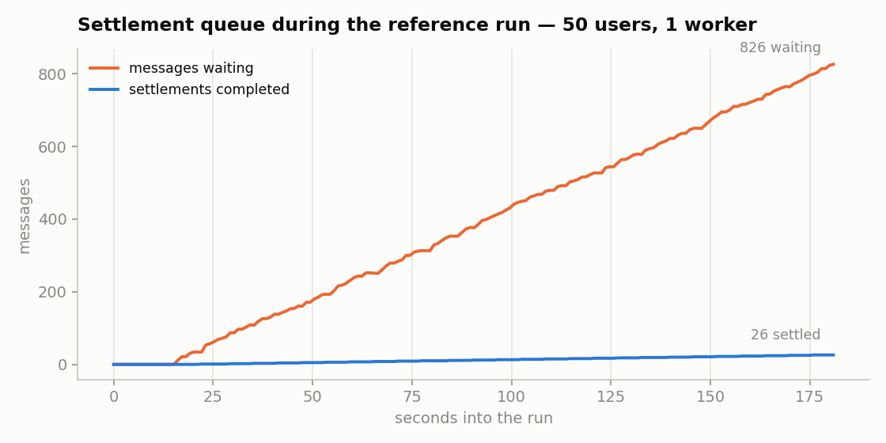
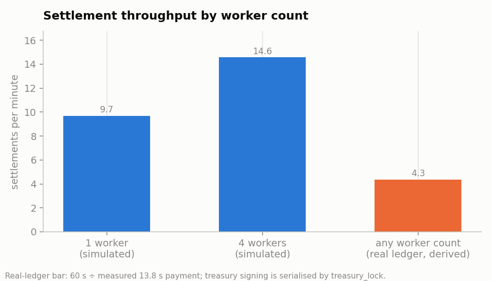
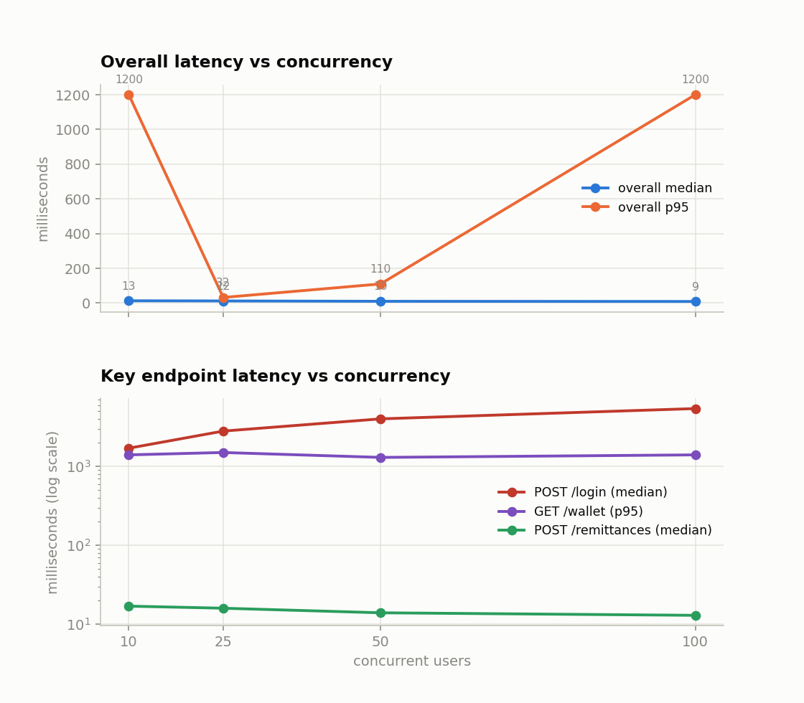

# Performance Report — XRPL FX Remittance Platform

**Note** ·

Every figure in this report comes from one run of `make perf-all`. The tables are
generated into [`results/summary.md`](results/summary.md) by `perf/analyze.py`. The raw files
are in [`results/`](results/) and the run's metadata in
[`results/run_meta.json`](results/run_meta.json). Each figure names the sub-run it comes from:

| Sub-run | What it is |
| --- | --- |
| `run` | Reference load run: 50 users for 3 minutes |
| `c10`, `c25`, `c50`, `c100` | Concurrency tiers: 10, 25, 50 and 100 users for 2 minutes each |
| `workers1`, `workers4` | The same 30-settlement backlog drained by 1 worker, then by 4 |
| `xrpl` | Real XRPL Testnet timings (`measure_xrpl.py`): 1 account, 1 trust line, 3 payments |

Figures marked *derived* are calculated using measured values and their formula is given.

---

## Executive Summary

The web tier is fast and stable. In the reference run (`run`) 50 concurrent users generated
**6,962 requests at 38.7 requests per second with 0 failures**, a **10 ms median** and a
**62 ms 95th percentile**. Across all five load sub-runs, 23,173 requests produced no failed
request. Throughput rose from 8.2 requests per second at 10 users to 68.3 at 100.

Three constraints stand out:

1. **Login blocks the server.** Password verification (bcrypt) runs synchronously inside the
   async login handler, so it holds Uvicorn's single event loop. Login median time grew from
   1,700 ms at 10 users to 5,400 ms at 100, and the slowest responses of otherwise-fast
   endpoints fall in the same range.
2. **Settlement is far slower than cash-in.** In `run` the admins confirmed 853 cash-ins in
   180 seconds while one simulated worker settled 8.6 per minute and 826 messages were still
   waiting at the end. On the real ledger the ceiling is lower still: every payment is signed
   under `treasury_lock`, so settlement cannot exceed 60 ÷ 13.8 s = **4.3 per minute** whatever
   the number of workers (*derived*).
3. **The wallet page waits on the ledger.** `GET /wallet` makes a live Testnet balance call
   whenever the recipient has a wallet and those views take about 1.3 s.

Money-moving paths are correct under load: 0 of 159 settlements failed, every completed
settlement has a hash, no settlement needed a retry, and concurrent duplicate cash-in
confirmations never published a second settlement message.

---

## 1. Test Environment and Method

### Environment (from `run_meta.json`)

| Item | Value |
| --- | --- |
| Machine | Apple M2, 8 cores, 8.0 GB RAM, macOS 26.3.1 (arm64) |
| Topology | App, PostgreSQL, Redis, workers and Locust all on this one host |
| Python | 3.11.16 (project virtualenv) |
| Web server | Uvicorn 0.32.1, FastAPI 0.115.5; one process, no `--reload`, `--no-access-log` |
| Database | PostgreSQL 16.15 (Homebrew); SQLAlchemy 2.0.36, asyncpg 0.30.0 |
| Queue | Redis 8.10.2; RQ 2.0.0 |
| Load driver | Locust 2.32.4, spawn rate 5 users per second |
| XRPL client | xrpl-py 4.0.0 |
| Code | Commit `1c668c0` on `main`; only `perf/results/` differed from the commit |

### Isolation and fresh state

The run used its own database (`remittance_perf`, recreated at the start) and its own Redis
database (`redis://localhost:6379/14`), never the application's. Before **every** sub-run the
runner stopped all processes, flushed that Redis database (so no run inherits another's queue),
and purged and re-seeded 200 synthetic sender/recipient pairs (so no run inherits another's
used-up daily limits). Each load sub-run started a fresh Uvicorn process, one settlement worker
and the queue sampler. Database outcome counts were saved at the end of each sub-run.

### Simulated and real ledger

Load and worker-scaling sub-runs used `perf/perf_worker.py`: the real queue, claim, database
writes, wallet credit and `treasury_lock`, with the two XRPL calls replaced by fixed delays —
2.0 s for wallet provisioning (outside the lock) and 4.0 s for the treasury payment (inside it).
Real on-chain timings were measured separately in the same session (sub-run `xrpl`).
`GET /wallet` still made its normal read-only balance call to the public Testnet during load.

### Load profile (`perf/locustfile.py`)

| User type | Weight | Behaviour |
| --- | ---: | --- |
| SenderUser | 6 | Login, open the send page, then: dashboard, quote, full send with the approved test card, send with the declined card `4000000000000002` (weight 1 of 15), history |
| RecipientUser | 3 | Login, then: wallet, cash-out history, cash-out preview (and request when a balance exists) |
| AdminUser | 1 | Login, then: confirm up to 10 pending cash-ins per visit to the queue, settlement and transaction monitors |

Locust assigns user types by weight, so about one user in ten is an admin: one at 10 users,
several at 25 and above.

---

## 2. API Response Times



Reference run `run` — 50 users, 3 minutes (`run_stats.csv`):

| Endpoint | Requests | Failures | Median (ms) | p95 (ms) | p99 (ms) | Max (ms) | Req/s |
| --- | ---: | ---: | ---: | ---: | ---: | ---: | ---: |
| **All requests** | 6,962 | 0 | 10 | 62 | 2,400 | 8,068 | 38.7 |
| GET /send/pay | 1,029 | 0 | 6 | 12 | 36 | 1,630 | 5.7 |
| GET /send/review | 1,029 | 0 | 7 | 20 | 150 | 4,179 | 5.7 |
| POST /admin/cashin/{id}/received | 909 | 0 | 13 | 23 | 35 | 48 | 5.1 |
| POST /remittances | 856 | 0 | 14 | 24 | 61 | 626 | 4.8 |
| GET /quote (API) | 637 | 0 | 7 | 32 | 1,500 | 3,022 | 3.5 |
| GET /wallet | 581 | 0 | 17 | 1,300 | 2,100 | 3,221 | 3.2 |
| GET /dashboard | 497 | 0 | 11 | 25 | 71 | 1,738 | 2.8 |
| POST /cashout/preview | 340 | 0 | 9 | 25 | 180 | 4,757 | 1.9 |
| GET /transactions | 333 | 0 | 9 | 23 | 63 | 564 | 1.9 |
| GET /cashout/history | 218 | 0 | 10 | 36 | 3,500 | 4,880 | 1.2 |
| GET /admin/cashin | 198 | 0 | 10 | 40 | 2,100 | 2,657 | 1.1 |
| POST /remittances (declined) | 172 | 0 | 14 | 24 | 48 | 1,355 | 1.0 |
| POST /login | 50 | 0 | 4,300 | 7,100 | 8,100 | 8,068 | 0.3 |
| GET /admin/transactions | 48 | 0 | 49 | 130 | 3,500 | 3,511 | 0.3 |
| GET /admin/settlements | 35 | 0 | 6 | 13 | 25 | 25 | 0.2 |
| GET /send | 30 | 0 | 1,600 | 3,800 | 4,400 | 4,376 | 0.2 |

**The money-moving path is fast.** `POST /remittances` locks the sender's row, re-prices the
quote, checks daily and monthly limits, inserts the transaction and returns: 14 ms median,
24 ms p95. The declined-card path has the same median and p95.

**Sub-second at p95:** every endpoint in `run` meets it except
`POST /login` (7,100 ms), `GET /send` (3,800 ms) and `GET /wallet` (1,300 ms). `GET /send`
is requested once per sender, at start-up, while all the logins are running. In `c10`, where only 10 logins run, its median is 11 ms and its p95 43 ms.

---

## 3. Requests per Second

| Sub-run | Users | Duration | Requests | Req/s |
| --- | ---: | --- | ---: | ---: |
| `c10` | 10 | 2 min | 983 | 8.2 |
| `c25` | 25 | 2 min | 2,351 | 19.6 |
| `c50` | 50 | 2 min | 4,691 | 39.2 |
| `run` | 50 | 3 min | 6,962 | 38.7 |
| `c100` | 100 | 2 min | 8,186 | 68.3 |

Ten times the users produced 8.3 times the throughput (68.3 ÷ 8.2, *derived*). The two
50-user sub-runs agree (39.2 and 38.7). No sub-run showed a failed request, so the server had
not reached a point where it refused or errored under this load.

---

## 4. Settlement Queue and Worker Throughput



### Under load, one simulated worker (`queue_<sub-run>.csv`, `<sub-run>_outcomes.json`)

| Sub-run | Users | Cash-ins received (DB) | Settled while sampled | Settled per minute | Queue depth at end |
| --- | ---: | ---: | ---: | ---: | ---: |
| `c10` | 10 | 119 | 18 | 8.9 | 100 |
| `c25` | 25 | 272 | 18 | 8.9 | 253 |
| `c50` | 50 | 584 | 17 | 8.5 | 566 |
| `run` | 50 | 853 | 26 | 8.6 | 826 |
| `c100` | 100 | 935 | 15 | 7.5 | 918 |

In `run`, cash-ins were confirmed at about 4.7 per second (853 ÷ 180 s, *derived*) and settled
at 8.6 per minute. The queue grew for the whole run in every sub-run. At 100 users the single
worker's rate dropped to 7.5 per minute. The worker shares the machine with the web server and
100 simulated users.

### Worker scaling — the same backlog (`run_meta.json`, `workers<N>_outcomes.json`)



Each drain started from 30 confirmed cash-ins for 30 recipients with no wallet yet, booked through
the real cash-in code after a purge and re-seed, and was timed from "all workers registered" to
"all 30 settled".

| Sub-run | Workers | Drain time (s) | Completed | Settlements per minute | vs 1 worker |
| --- | ---: | ---: | ---: | ---: | ---: |
| `workers1` | 1 | 186.2 | 30 | 9.7 | 1.00× |
| `workers4` | 4 | 123.6 | 30 | 14.6 | 1.51× |

Four workers gave 1.51 times the throughput of one, not four times. This is `treasury_lock` at
work: each settlement takes 2.0 s of provisioning, which workers can overlap, and 4.0 s of
payment, which they cannot. The ceilings implied by those simulated delays (*derived*) are
60 ÷ 6.0 = 10.0 per minute for one worker and 60 ÷ 4.0 = 15.0 per minute for any number. The
measured 9.7 and 14.6 sit just below them.

### Real-ledger capacity (*derived*)

With the measured real payment time of 13.8 s, the lock caps real settlement at
60 ÷ 13.8 = **4.3 per minute regardless of worker count**. Extra workers can only overlap wallet
provisioning (faucet account and TrustSet, 12.06 s + 15.27 s for a new recipient). At that
ceiling the 826 messages left in `run` would take at least 826 × 13.8 s ≈ 3.2 hours to settle.

---

## 5. XRPL Processing Time

Sub-run `xrpl`: `perf/measure_xrpl.py` against the public XRPL Testnet, in the same session
(`xrpl_timings.json`).

| Step | Samples | Min (s) | Mean (s) | Max (s) |
| --- | ---: | ---: | ---: | ---: |
| Create recipient account (faucet) | 1 | 12.06 | 12.06 | 12.06 |
| TrustSet to issuer | 1 | 15.27 | 15.27 | 15.27 |
| Treasury → recipient payment | 3 | 13.48 | 13.8 | 13.99 |
| **First transfer to a new recipient** | 1 | — | **41.25** | — |

A recipient's first transfer took 41.25 s end to end, because the worker must create and fund
the account and set its trust line before paying. Later transfers to the same recipient cost
only the payment: 13.8 s on average. Each timing includes waiting for a validated ledger.

---

## 6. Success and Failure Rates

### HTTP

No request failed in any load sub-run: 0 of 23,173 (6,962 + 983 + 2,351 + 4,691 + 8,186).
The exception files are empty and no traceback appears in any server, worker or sampler log
(`run_meta.json`).

### Cash-in outcomes (`<sub-run>_outcomes.json`, end of each sub-run)

| Sub-run | Card declined (failed) | Received | Pending | Declined-card sends (Locust) |
| --- | ---: | ---: | ---: | ---: |
| `run` | 172 | 853 | 3 | 172 |
| `c10` | 32 | 119 | 5 | 32 |
| `c25` | 54 | 272 | 3 | 54 |
| `c50` | 121 | 584 | 2 | 121 |
| `c100` | 192 | 935 | 8 | 192 |

Every failed cash-in is an intentional declined-card send: the counts equal the declined-card
requests in each sub-run. Approved-card sends equal received plus pending in every sub-run
(for example `run`: 856 = 853 + 3). Pending rows are sends no admin had confirmed when the
sub-run ended.

### Settlement outcomes

| Sub-run | Completed | Queued (backlog) | Failed | Completed without a hash | Max attempts |
| --- | ---: | ---: | ---: | ---: | ---: |
| `run` | 27 | 826 | 0 | 0 | 1 |
| `c10` | 19 | 100 | 0 | 0 | 1 |
| `c25` | 19 | 253 | 0 | 0 | 1 |
| `c50` | 18 | 566 | 0 | 0 | 1 |
| `c100` | 16 | 919 | 0 | 0 | 1 |
| `workers1` | 30 | 0 | 0 | 0 | 1 |
| `workers4` | 30 | 0 | 0 | 0 | 1 |

**Settlement failure rate: 0 of 159.** Every settlement a worker reached completed on its first
attempt and carries a transaction hash. Queued rows are backlog, not failures.

### Concurrent admins and duplicate confirmations

Locust counted more confirmation requests than the database recorded received cash-ins:

| Sub-run | Confirmations (Locust) | Received (DB) | Refused as already processed (*derived*) |
| --- | ---: | ---: | ---: |
| `c10` | 119 | 119 | 0 |
| `c25` | 302 | 272 | 30 |
| `c50` | 650 | 584 | 66 |
| `run` | 909 | 853 | 56 |
| `c100` | 1,101 | 935 | 166 |

Only `c10` had a single admin. Above that, several admin users worked the same queue and
posted confirmations for the same rows. The confirmation is a conditional update
(`pending → received`), so the second request for a row changes nothing and is answered
"already processed" with a redirect, which Locust records as a success. No duplicate reached
the queue: the queue depth at the end matches the database's queued rows in `run` (826 = 826),
`c10` (100 = 100), `c25` (253 = 253) and `c50` (566 = 566), and differs by one in `c100`
(918 against 919), where one message was in flight when sampling stopped.

---

## 7. Concurrency Behaviour



### All requests by tier (`c<N>_stats.csv`)

| Users | Requests | Failures | Median (ms) | p95 (ms) | Max (ms) | Req/s |
| ---: | ---: | ---: | ---: | ---: | ---: | ---: |
| 10 | 983 | 0 | 13 | 1,200 | 2,594 | 8.2 |
| 25 | 2,351 | 0 | 12 | 32 | 5,781 | 19.6 |
| 50 | 4,691 | 0 | 10 | 110 | 7,964 | 39.2 |
| 100 | 8,186 | 0 | 9 | 1,200 | 9,757 | 68.3 |

The median stays between 9 and 13 ms at every tier. The p95 depends on how much of the traffic
is slow. At 10 users, 72 of 983 requests (7.3 %, *derived*) were wallet views, mostly making the
~1.3 s ledger call, so the p95 lands on them. At 100 users, logins (100), send-page loads (60)
and the slow 5 % of 720 wallet views together make up about 2.4 % of 8,186 requests (*derived*),
yet 5 % of requests took 1,200 ms or more: otherwise-fast requests were also delayed.

### Login (`POST /login`)

| Sub-run | Users | Median (ms) | p95 (ms) | Max (ms) |
| --- | ---: | ---: | ---: | ---: |
| `c10` | 10 | 1,700 | 2,600 | 2,594 |
| `c25` | 25 | 2,800 | 5,800 | 5,781 |
| `c50` | 50 | 4,000 | 6,400 | 7,964 |
| `run` | 50 | 4,300 | 7,100 | 8,068 |
| `c100` | 100 | 5,400 | 7,500 | 9,394 |

Login time rises with the number of users logging in at once. `authenticate_user` calls
`verify_password` (bcrypt, deliberately slow) directly inside an `async` request, so while a
hash is being checked the event loop serves nothing else. That is also why the slowest
responses of fast endpoints match login times: in `c100`, `POST /remittances` had a 13 ms median
but a 9,582 ms maximum, against a 9,394 ms maximum login.

### Money-moving endpoints (`POST /remittances`)

| Sub-run | Users | Requests | Median (ms) | p95 (ms) | Max (ms) |
| --- | ---: | ---: | ---: | ---: | ---: |
| `c10` | 10 | 124 | 17 | 23 | 44 |
| `c25` | 25 | 275 | 16 | 21 | 90 |
| `c50` | 50 | 586 | 14 | 23 | 1,317 |
| `run` | 50 | 856 | 14 | 24 | 626 |
| `c100` | 100 | 943 | 13 | 31 | 9,582 |

Median and p95 stay flat from 10 to 100 users: the sender-row lock (`SELECT … FOR UPDATE`)
showed no contention. Each seeded sender is a separate row, so this does not test many users
sending from one account.

### Wallet page (`GET /wallet`)

| Sub-run | Users | Requests | Median (ms) | p95 (ms) | Max (ms) |
| --- | ---: | ---: | ---: | ---: | ---: |
| `c10` | 10 | 72 | 1,300 | 1,400 | 1,639 |
| `c25` | 25 | 186 | 17 | 1,500 | 2,570 |
| `c50` | 50 | 381 | 15 | 1,300 | 3,957 |
| `run` | 50 | 581 | 17 | 1,300 | 3,221 |
| `c100` | 100 | 720 | 10 | 1,400 | 4,870 |

The page calls the ledger only when the recipient already has a wallet, which is created on
their first settlement. The medians are consistent with that: in `c10` (3 recipients, 19
settlements) most views made the call (median 1,300 ms). In `c100`, 16 settlements could have
given wallets to at most 16 of the 30 logged-in recipients, and the median was 10 ms, with the
call showing in the p95.

### Send page (`GET /send`)

| Sub-run | Users | Median (ms) | p95 (ms) |
| --- | ---: | ---: | ---: |
| `c10` | 10 | 11 | 43 |
| `c25` | 25 | 250 | 1,800 |
| `c50` | 50 | 1,400 | 2,800 |
| `run` | 50 | 1,600 | 3,800 |
| `c100` | 100 | 2,300 | 3,800 |

Each sender loads this page once, straight after logging in, so its time tracks the login queue.

---

## 8. Bottlenecks

**1. Synchronous bcrypt on the event loop.** `verify_password` runs inside the async login
handler and blocks Uvicorn's single event loop. Login median rose from 1,700 ms (`c10`) to
5,400 ms (`c100`), and fast endpoints inherited the stall (a 9,582 ms maximum on
`POST /remittances` in `c100`). `GET /send`, loaded straight after login, is slow for the same
reason.

**2. Settlement throughput.** Under every load, one worker settled well under 10 per minute
while cash-ins were received at between 1.0 per second (`c10`, 119 ÷ 120 s) and 7.8 per second
(`c100`, 935 ÷ 120 s) (*derived*), so the backlog grew throughout. More
workers help only with wallet provisioning: with `treasury_lock`, 4 simulated workers reached
14.6 per minute against 9.7 for one (1.51×), and the real ledger is capped at 4.3 per minute
by the 13.8 s payment.

**3. Live ledger call on the wallet page.** Views that make the call take about 1.3 s (`c10` median 1,300 ms). In every sub-run it sets the wallet page's p95 (1,300-1,500 ms).

**4. No database contention observed.** `POST /remittances` stayed at a 13–17 ms median and a 21–31 ms p95 from 10 to 100 users.

---

## 9. Recommendations

| Priority | Change | Expected effect |
| ---: | --- | --- |
| 1 | Run `verify_password` and `get_password_hash` off the event loop (`asyncio.to_thread` or Starlette's `run_in_threadpool`); keep bcrypt's cost | Logins no longer stall other requests; login time reflects bcrypt alone |
| 2 | Raise real-ledger settlement throughput at the treasury, not with more workers: hold `treasury_lock` only while the sequence is allocated and the payment signed and submitted, tracking the treasury sequence locally, and wait for validation outside the lock; or split payments across several treasury accounts, each with its own lock | Lifts the 4.3-per-minute ceiling, which currently no number of workers can move |
| 3 | Keep 2–4 workers for the provisioning overlap only | Measured 1.51× with 4 simulated workers; real-ledger payment throughput unchanged |
| 4 | Render `GET /wallet` from the cached `balance_uctusd` and fetch the ledger balance in the background or with a short cache | Removes the ~1.3 s call from page loads |
| 5 | In production, run several Uvicorn processes | Spreads CPU work across cores; a blocked loop affects only its own process |

For the test itself: give `AdminUser` `fixed_count = 1` so there is exactly one admin at every
tier, and take a larger real-ledger sample.

---

## 10. Limitations and Caveats

**Simulated ledger.** Load and worker-scaling sub-runs replaced the XRPL calls with fixed
delays (2.0 s provisioning, 4.0 s payment). Queue behaviour, claims, database writes, wallet
credits and `treasury_lock` are real, while ledger latency, variance and rate limits are not. The
simulated settlement rates are not real-ledger rates. Section 4 gives the real-ledger ceiling separately.

**Small XRPL sample.** Sub-run `xrpl` measured 1 account creation, 1 trust line and 3 payments on
the shared public Testnet. That is enough for an order of magnitude, not a distribution.

**Single machine.** The application, PostgreSQL, Redis, workers and Locust shared one 8-core,
8 GB laptop. Latencies include that contention and the lower single-worker rate at 100 users may reflect it.

**Short sub-runs with a login ramp.** Every sub-run starts with all users logging in at 5 per
second, and the tiers last 2 minutes, so the login stall is a noticeable share of each tier.

**Live Testnet reads.** `GET /wallet` called the public Testnet during load, so its timings
depend on that network at the time of the run.

**Several admins above 10 users.** Locust's weighting produced more than one admin from 25
users up, so confirmation counts from Locust include refused duplicates and database counts
are used throughout.

---

## Appendix: Reproducing the Results

```bash
# Postgres and Redis running with the project virtualenv installed from requirements.txt.
make perf-all                     # simulated ledger only + keeps the existing xrpl_timings.json
PERF_REAL_XRPL=1 make perf-all    # also re-measures Testnet timings (spends about 1.5 UCTUSD)
```

`perf/run_all.py` documents every parameter. It writes all files to `perf/results/`,
`results/summary.md` holds every table in this report, and `results/run_meta.json` holds the
environment, parameters, per-sub-run records and a manifest of every file. This run took
18 minutes 14 seconds with the real-ledger step included.
